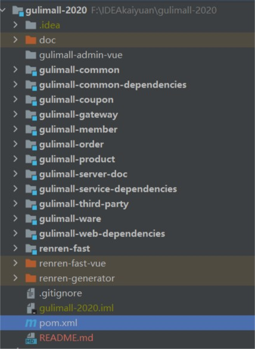

# 一、工程结构
```markdown
gulimall    // 父工程 管理所有的依赖
----gulimall-service-dependencies   //  service  依赖
----gulimall-web-dependencies       // web 依赖
----gulimall-common-dependencies    // 公共依赖
----gulimall-gateway                // 网关
----gulimall-third-party            // 三方服务
----gulimall-product                // 商品服务
----gulimall-member                 // 用户服务
----gulimall-order                  // 订单服务
----gulimall-ware                   // 库存服务
----gulimall-coupon                 // 优惠服务
----renren-fast                     // 快速开发平台
----gulimall-common                 // 公共模块
----gulimall-server-doc             // api 文档
----renren-fast-vue                 // 后台管理页面
----renren-generator                // 逆向工程
---- doc                            // 文档资料
```

# 二、分支结构
```markdown
----base            // 基础篇   
----base-project    // 基础工程
----base-super      // 在基础篇的基础上 聚合文档
----master          // 总分支
```
