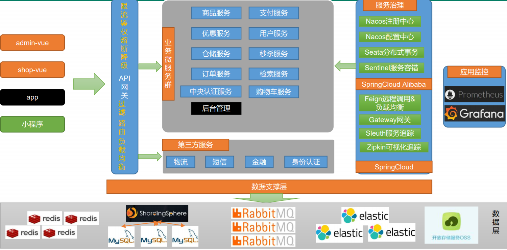

# 一、项目简介

## 1）、项目背景

5中常见的电商模式 ==B2B== 、==B2C==、==C2B==、==C2C==、==O2O== ;

### 1、 B2B 模式

Business to Business, 是指商家与商家建立的商业关系， 如：阿里巴巴

### 2、 B2C 模式 ==(谷粒商城模式)*==

Business to Consumer ， 供应商直接把商品卖飞用户，既“商对客”模式，也就是场所的商业零售，直接面向消费者销售产品和服务。如：苏宁易购、京东

### 3、 C2B 模式

Consumer to Business ， 消费者对企业，现有消费者需求产生而后有企业生产

### 4、 C2C 模式

Consumer to Consumer ,客户之间吧东西放在网上卖， 如：咸鱼、淘宝

### 5、 O2O 模式

Online To Offline, 既线下商务机会与互联网结合在了一起，让互联成为线下交易的前台。线上快速致富，线下优质服务。如：饿了么，淘淘票

## 2）、项目技术&特色

- 前后端分离 ，基于vue的后台管理系统
- SpringCloud全新解决方案
- 应用监控、限流、网关、熔断降级等分布式方案
- 分布式事务、分布式锁
- 高并发下的编码方式、线程池、异步编排
- 压力测试、与性能优化
- 各种集群技术的区别以及使用
- CI/CD使用
- ....

## 3）、前置知识

- 熟悉springboot以及常见的整合方案
- 了解springcloud
- 熟悉maven、git、Linux、redis、docker
- 了解html、css、js
- 熟练使用idea

# 二、 项目架构图

