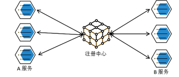
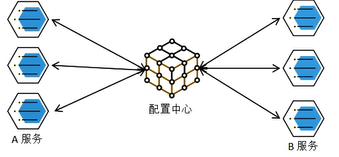
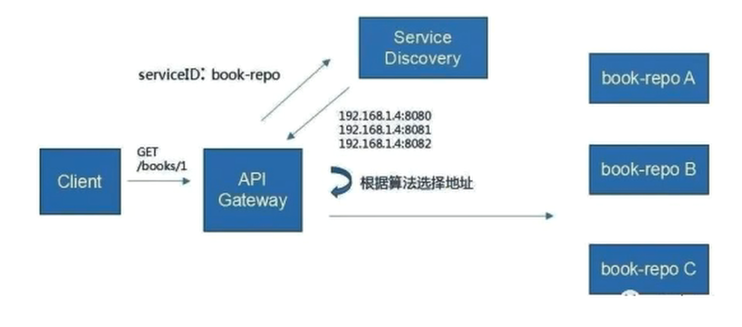

## 1、微服务

微服务架构风格，就像是把一个==单独的应用==程序开发为一套==小服务==，每个小服务运行在自己的进程中，并使用轻量级的机制通信，通常是HTTP API。 这些服务围绕着业务能力来构建，并通过完成自动化部署机制来独立部署。这些服务使用不用的编程语言来书写，以及不同的数据存储技术，并保存最低限度的集中管理

> 简而言之：拒接大型单体应用，基于业务边界进行服务微化拆分，各个服务独立部署运行。

## 2、 集群&分布式&节点

集群是个物理形态，分布式是个工作方式

只要是一堆机器，就可以叫集群，他们是不是协作干活，这个谁也不知道；

分布式是指将不同的业务分布在不同的地方。

**集群**指的是将几台服务器集中在一起，实现统一业务。

**例如：** 京东是一个分布式系统，众多业务运行在不同的机器，所有业务构成一个大型的**业务集群**，每一个小的业务，比如用户西戎，访问压力大的时候一台服务器是不够的。就可以将用户系统部署到多个服务器上，也就是每一个业务也可以做**集群化**

> 分布式每一个节点，都可以做集群，而集群并不一定就是分布式的

**节点**： 集群中的一个服务器

##  3、远程调用

在分布式系统中，各个服务可能处于不同的主机，但是服务之间需要互相调用，我们称之为远程调用。

SpringCloud 中 使用HTTP +  JSON 的方式完成远程调用

## 4、负载均衡

分布式系统中，A服务需要调用B服务在多台机器中存在，A调用任意一个服务器均可完成功能。

为了使每一个服务都不要太忙或太闲， 我们可以负载均衡的盗用每一个服务器提升网站的键壮性。

###  常见的负载均衡算法

### ①、轮询

为第一个请求选择**健康池**中的第一个后端服务器， 然后按顺序往后依次选着，直接到最后一个，然后循环

### ②、最小连接

优先选着连接数量少的，也就是压力最小的后端服务器，在会话较长的情况下可以考虑采取这种方式

### ③、散列算法

根据请求的IP的散列（Hash） 来选择转发的服务器。这种方式可以一定程度上保证特定用户能连接到相同的服务器。如果你的应用需要处理状态二需求用户能连接到和之前相同的服务器，客户考虑采取这种方式。

## 5、服务注册/发现&注册中心

如果某些服务下线，其他人可以实时的感知到其他服务的状态，从而避免调用不可用的服务

## 6、配置中心

每一个服务最终都有大量的配置，并且每个服务都可能部署在多台机器上。经常需要变更配置，我们可以让每个服务在配置中心获取自己的配置

> ==配置中心用来集中管理微服务配置信息==

##  7、服务熔断&服务降级

在微服务架构中，微服务之间通过网络通信，存在互相依赖， 当其中一个服务不可用时，有可能找出雪崩效应。要防止这样的情况，必须要有容错机制来保护服务

### ①、服务熔断

设置服务的超时，当被调用的服务经常失败到达摸个阀值，就可以开启断路保护机制，后来请求不再去调用这个服务，本地直接返回默认的数据。

### ②、服务降级

在运维期间，当系统处于高峰期，系统资源紧张。我们可以让非核心业务降级运行。**降级**：某些服务不处理，或者简单处理【抛异常、返回NULL 、调用Mock数据、调用Fallback处理逻辑】

## 8、API 网关

在微服务架构中，API GateWay 作为整体架构的重要组件，它抽象了，微服务中都需要的公共功能，同时提供了==客户端负载均衡==，==服务自动熔断==，==灰度发布==，==统一认证==、==限流流控==、==日志统计==等丰富功能，帮助我们解决很多API管理难题。

