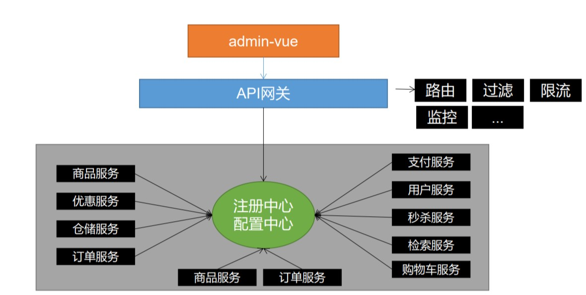
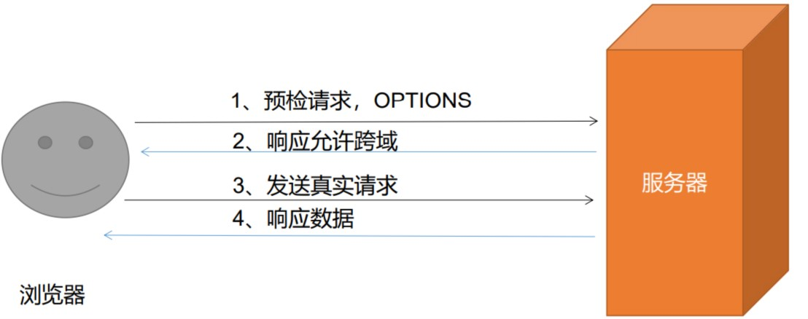
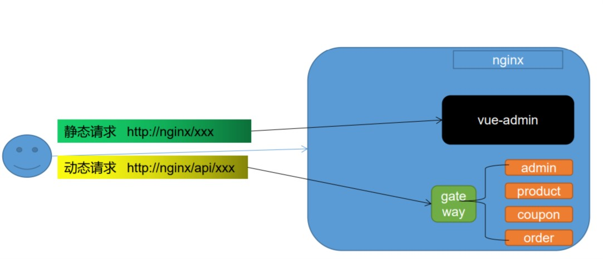
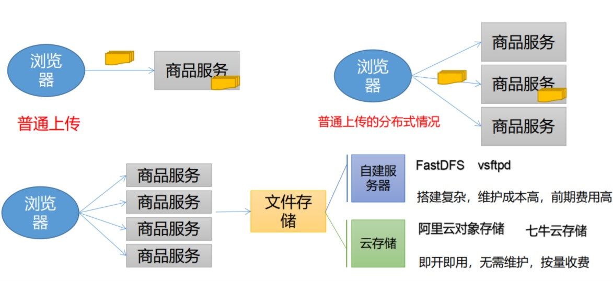
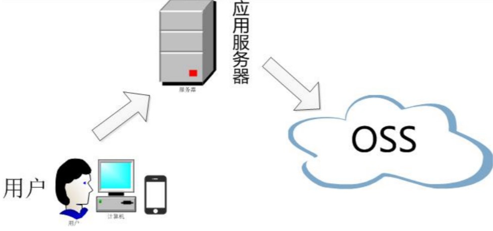
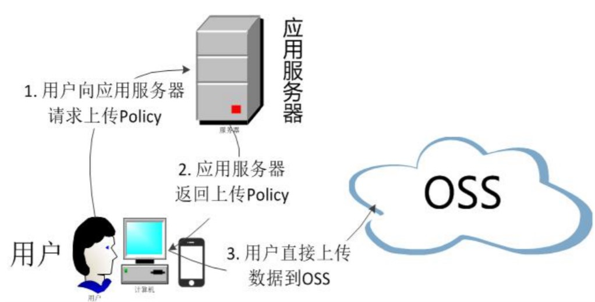

## 一 、网关:



> 挡在所有服务的最前沿 , 可以决定 是否放行 、 鉴权、过滤、限流、监控 等等

## 二、跨域
- *跨域*：指的是浏览器不能执行其他网站的脚本。它是由浏览器的同源策略造成的，是
浏览器对javascript施加的安全限制。
- *同源策略*：是指协议，域名，端口都要相同，其中有一个不同都会产生跨域

|URL|说明|是否跨域|
|----|----| ----|
|http://www.a.com/a.js <br> http://www.a.com/b.js| 同一域名下 | 允许|
|http://www.a.com/lib/a.js <br> http://www.a.com/script/b.js| 同一域名下不同文件 | 允许|
|http://www.a.com/a.js <br> http://www.a.com:8080/b.js| 同一域名下 不同端口 | 不允许|
|http://www.a.com/a.js <br> https://www.a.com/b.js| 同一域名下,不同协议 | 不允许|
|http://www.a.com/a.js <br> http://192.168.2.23/b.js| 域名与域名ip  | 不允许|
|http://www.a.com/a.js <br> http://script.a.com/b.js| 主域名相同，子域名不同 | 不允许|
|http://www.a.com/a.js <br> http://a.com/b.js| 同一域名，不同二级域名 | 不允许(cookie也不允许访问)|
|http://www.a.com/a.js <br> http://www.b.cn/b.js| 不同域名 | 不允许|

### 跨域流程
非简单请求（put/delete）先发送预检请求 (option)

### 跨域解决方案 (一) ：借用 nginx ，部署为同一域

### 跨域解决方案 (二) ：配置当前请求跨域
*主要原理*： 添加响应头

|响应头| 含义|
|----|----|
| Access-Control-Allow-Origin |支持哪些来源的请求跨域 |
|Access-Control-Allow-Methods | 支持哪些方法跨域 |
|Access-Control-Allow-Credentials| 跨域请求默认不包含cookie，设置为true可以包含cookie |
| Access-Control-Expose-Headers | 跨域请求暴露的字段<br> CORS请求时，XMLHttpRequest对象的getResponseHeader()方法只能拿到6个基本字段：<br> Cache-Control、Content-Language、Content-Type、Expires、Last-Modified、Pragma。<br>如果想拿到其他字段，就必须在Access-Control-Expose-Headers里面指定。
|Access-Control-Max-Age| 表明该响应的有效时间为多少秒。在有效时间内，浏览器无须为同一请求再次发起预检请求。<br>请注意，浏览器自身维护了一个最大有效时间，如果该首部字段的值超超过了最大有效时间，将不会生效。|

#### 配置实例
- ① 网关处配置统一跨域(gateway)
```java
@Bean
public CorsWebFilter corsWebFilter(){
   UrlBasedCorsConfigurationSource source = new UrlBasedCorsConfigurationSource();
   CorsConfiguration corsConfiguration = new CorsConfiguration();
   corsConfiguration.addAllowedHeader("*");
   corsConfiguration.addAllowedMethod("*");
   corsConfiguration.addAllowedOrigin("*");
   corsConfiguration.setAllowCredentials(true);
   source.registerCorsConfiguration("/**",corsConfiguration);
   return new CorsWebFilter(source);
}
```
- ② 单体应用配置跨域
```java
public class CorsConfig implements WebMvcConfigurer {
    @Override
    public void addCorsMappings(CorsRegistry registry) {
        registry.addMapping("/**")
            .allowedOrigins("*")
            .allowCredentials(true)
            .allowedMethods("GET", "POST", "PUT", "DELETE", "OPTIONS")
            .maxAge(3600);
    }
}
```
- ③ 使用注解 配置单个controller 跨域
```java
@CrossOrigin // spring提供的跨域注解
public class GrowthChangeHistoryController {}
```
- ④ 前端跨域 

> 以上方式 配置一种即可， 重复配置会报 容易配置的错误

## 三、文件存储
- 1、通过保存到本地
- 2、写入直接存入数据库(会导致数据库效能下降)
- 3、自己部署文件系统(fastDFS 等)  (软件/FastDFS安装笔记.md)
- 4、第三方的 oss (七牛云、阿里云 等)


### 文件上传的方式
- ①、先到自己服务器 -> 服务器上传到 oss -> 返回 图片路径
   
- ②、向服务器拉取签名 -> 浏览器直传 oss -> 返回 图片路径
