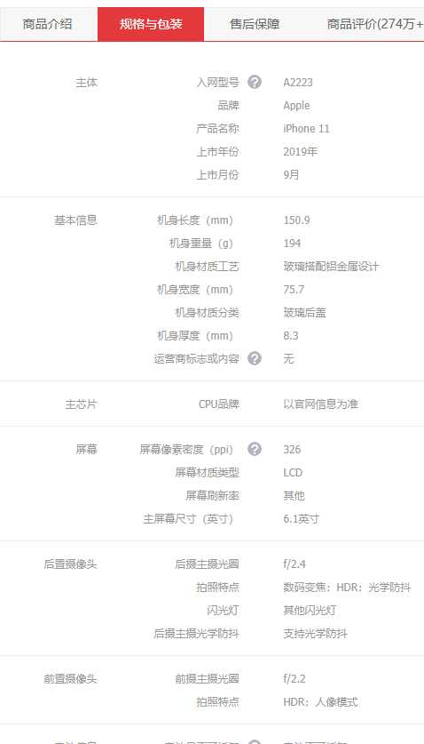
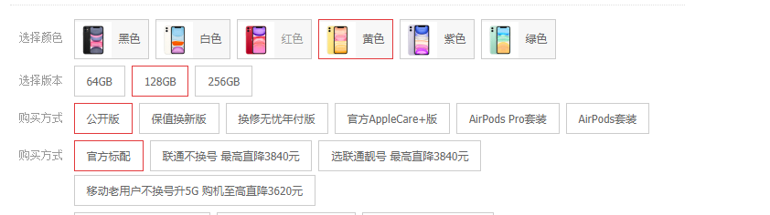
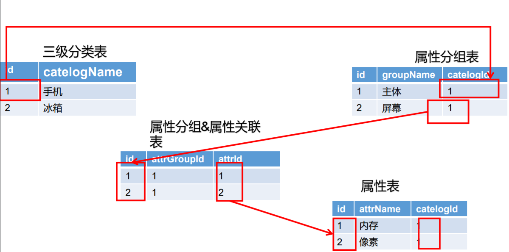
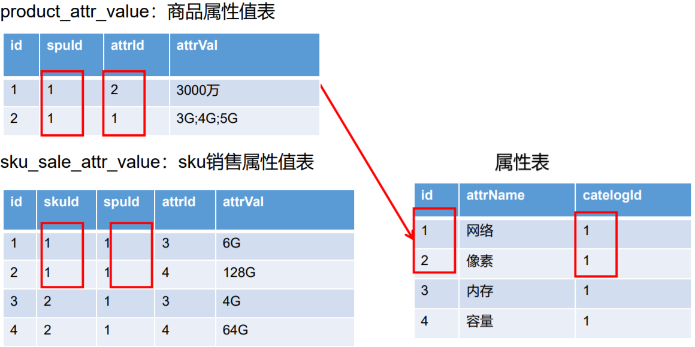

## 一、Spu&Sku

### 1、Spu

 standard product unit  :  标准的商品单元

是商品信息聚合的**最小**单位，是一组可以复用、易检索的标准化信息的集合，该集合描述了一个产品的特性  。例如苹果X 、苹果XS 

### 2、Sku

  stock keep unit : 库存存储单元，单位件、台、部、盒 

库存进出的最小单位，SKU这是对大型连锁超市DC（配送中心）物流管理的一个必要方法，先在已经被引申为产品统一编号的简称，每种产品均对应用唯一的sku号

> Spu 与 Sku关系 ： 范围上来说Spu包含sku 、Spu表和sku表是一对多的关系

### 3、基本属性【规格参数\规格与包装\商品介绍】与 销售属性【颜色、版本】

每个分类下的商品共享规格参数，与销售属性。只是有些商品不一定要这个分类下全部的属性；

- **属性**是三级分类组织起来的
- **规格参数**中有些是可以供检索的
- 规格参数也是基本属性 他们具有自己的分组
- **属性的分组** 也是以三级分类组织起来
- **属性名** 是确定的，但是值是每一个商品不同来决定

### 4、【属性分组-规格参数-销售属性-三级分类】关联关系

### 5、SPU-SKU-属性表

## 二、Object 划分
### 1、PO (Persistent Object) /entity 持久对象
对应表中的记录
### 2、DO (Domain Object) 领域对象
从现实世界中抽象出来的有形或无形的业务实体
### 3、TO (Transfer Object) 数据传输对象
不同的应用程序之间的对象传输
### 4、DTO (Data Transfer Object) 数据传输对象
概率来源于J2EE的设计模式，原来的目的是为了EJB的分布式应用提供粗粒度的数据实体，以减少分布式调用次数，从而提高调用性能和降低网络负载，但在这里用于展示与服务层之间的数据传输对象。
### 5、VO (Value Object / View Object) 值对象
通常用于业务层之间的数据传输，和PO一样 也是仅仅包含数据而已，但应是抽象出来的业务对象，可以和表对应，也可以不， 根据业务需要，用new 关键字创建，由GC回收
### 6、BO (Business Object) 业务对象
从业务模型的角度看，见UML元件领域对象，封装业务逻辑的java对象，通过调用dao方法，结合PO,VO 进行业务炒作，Business Object 业务对象，主要作用是吧业务逻辑封装成一个对象
### 7、POJO (Plan Ordinary Java Object) 简单无规则java对象
POJO是 DO/DTO/BO/VO的统称

### 7、POJO (Data Access Object )数据访问对象