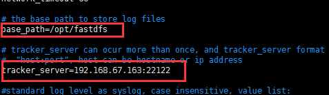

# **FastDfs**安装文档


## 一、安装顺序
1.  libfastcommon
2.  fdfs_tracker
   依赖：Gcc、libevent、perl
3. fdfs_storage
4.  FastDFS-nginx-module
5. nginx
   依赖：pcre-devel、zlib-devel

## 二、功能文件目录

Opt/fastdfs 数据存储目录

Usr/local/fdfs 启动文件目录

Etc/fdfs 配置文件目录

Usr/bin/fdfs_trackerd 启动配置

Etc/init.d/fdfs_trackerd 启动服务脚本

> 相关软件:              链接: https://pan.baidu.com/s/1tdszpFddyPBC_EbfzkAk6Q 提取码: enhi

## 三、FastDFS--tracker安装

### 3.1、 FastDFS安装环境

FastDFS是C语言开发，建议在linux上运行，本教程使用Centos7.4作为安装环境。

1. 安装gcc 依赖环境` yum install gcc-c++ -y`

### 3.2、libevent 

1. `yum -y install libevent`

2. 如果没有perl库，需要使用`yum install perl* `命令安装一下

```sh
yum -y install zlib zlib-devel pcre pcre-devel gcc gcc-c++ openssl openssl-devel libevent libevent-devel perl unzip net-tools wget
```

### 3.3、安装libfastcommon

1. 上传压缩包文件libfastcommonV1.0.7.tar.gz 到  /usr/local目录下，并解压。

2. `tar -zxvf libfastcommonV1.0.7.tar.gz`

3. 进入到解压后的文件夹中
   
4.  进行编译 ./make.sh
   如果出现编译perl 不识别 运行下面这段命令
   ```sh
   yum -y install zlib zlib-devel pcre pcre-devel gcc gcc-c++ openssl openssl-devel libevent libevent-devel perl unzip net-tools wget
   ```
   

5. 安装`./make.sh install`


>  注意：libfastcommon安装好后会自动将库文件拷贝至/usr/lib64下，由于FastDFS程序引用usr/lib目录所以需要将/usr/lib64下的库文件拷贝至/usr/lib下。` cp /usr/lib64/libfastcommon.so /usr/lib/`

## 四、安装tracker 

1. 上传资料FastDFS_v5.05.tar.gz到 `/usr/local `目录下

2.  解压编译安装

```sh
tar -zxvf FastDFS_v5.05.tar.gz
cd FastDFS
./make.sh
./make.sh install
```
3. 安装成功之后，将安装目录下的conf下的文件拷贝到`/etc/fdfs/`下。

   ```sh
   cd conf
   cp  *  /etc/fdfs/
   ```

4. 修改配置文件

   `vim /etc/fdfs/tracker.conf`

   


5. 创建fastdfs文件夹   `mkdir /opt/fastdfs`

## 五、设置启动项

1. 启动服务 ， 拷贝安装目录下stop.sh 和restart.sh 到/usr/local/fdfs/

```sh
mkdir /usr/local/fdfs  
cp restart.sh  /usr/local/fdfs/
cp stop.sh  /usr/local/fdfs/
```


2. 修改启动脚本 `vim /etc/init.d/fdfs_trackerd`
  

3. 注册服务   `chkconfig  --add  fdfs_trackerd`

4. 然后可以用service fdfs_trackerd start 启动测试 


## 六、FastDFS—storage配置

### 6.1、修改配置文件

`vim /etc/fdfs/storage.conf`


### 6.2、创建fdfs_storage文件夹

`mkdir /opt/fastdfs/fdfs_storage`

### 6.3、设置服务   

`vim  /etc/init.d/fdfs_storaged`


```sh
chkconfig - -add fdfs_storaged  // 配置为系统服务
service fdfs_storaged start  // 启动服务
```


### 6.4、上传图片测试

FastDFS安装成功可通过/usr/bin/fdfs_test测试上传、下载等操作。

修改/etc/fdfs/client.conf

``` vim /etc/fdfs/client.conf
vim /etc/fdfs/client.conf
base_path=/opt/fastdfs
tracker_server=192.168.67.163:22122```
```



测试命令: `/usr/bin/fdfs_test  /etc/fdfs/client.conf  upload  /root/winteriscoming.jpg`


对应的上传路径： `/opt/fastdfs/fdfs_storage/data /00/00/wKhDo1qipbiAJC6iAAB1tayPlqs094_big.jpg`


# FastDFS整合nginx

## 一、安装nginx整合插件fastdfs-nginx-module

上传fastdfs-nginx-module_v1.16.tar.gz上传到 /usr/local，并解压 `tar -zxvf fastdfs-nginx-module_v1.16.tar.gz`

编辑配置文件：修改config文件将` /usr/local/ `路径改为/usr/        (这里要修改三个路径)


将FastDFS-nginx-module/src下的mod_fastdfs.conf拷贝至 `/etc/fdfs/`下

[root@localhost src]# cp mod_fastdfs.conf /etc/fdfs/

并修改mod_fastdfs.conf的内容： `vim /etc/fdfs/mod_fastdfs.conf`


继续修改 url中包含group名称


 \#指定文件存储路径


将libfdfsclient.so拷贝至 `/usr/lib`下

[root@localhost src]# cp /usr/lib64/libfdfsclient.so /usr/lib/

## 二、安装nginx

#### 2.1、创建nginx/client目录

[root@localhost src]# mkdir -p /var/temp/nginx/client

#### 2.2、安装环境：

安装pcre库、zlib库        `yum -y install pcre-devel  zlib-devel`

#### 2.3、上传nginx

解压到  /usr/local       添加fastdfs-nginx-module模块

```sh
cd nginx-1.8.0
./configure \
--prefix=/usr/local/nginx \
--pid-path=/var/run/nginx/nginx.pid \
--lock-path=/var/lock/nginx.lock \
--error-log-path=/var/log/nginx/error.log \
--http-log-path=/var/log/nginx/access.log \
--with-http_gzip_static_module \
--http-client-body-temp-path=/var/temp/nginx/client \
--http-proxy-temp-path=/var/temp/nginx/proxy \
--http-fastcgi-temp-path=/var/temp/nginx/fastcgi \
--http-uwsgi-temp-path=/var/temp/nginx/uwsgi \
--http-scgi-temp-path=/var/temp/nginx/scgi \
--add-module=/usr/local/fastdfs-nginx-module/src
```


### 2.4 、编译 、安装  

```sh
make  
make install 
```

### 2.5、 编辑nginx.conf

vim /usr/local/nginx/conf/nginx.conf


### 2.6、启动nginx

`/usr/local/nginx/sbin/nginx`

### 2.7、设置开机启动

vim /etc/rc.d/rc.local


### 2.8、需要关闭防火墙

service iptables stop

永久关闭 chkconfig iptables  off

### 2.9、测试

/usr/bin/fdfs_test /etc/fdfs/client.conf upload /root/ty.jpg

