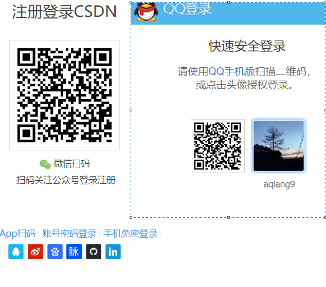
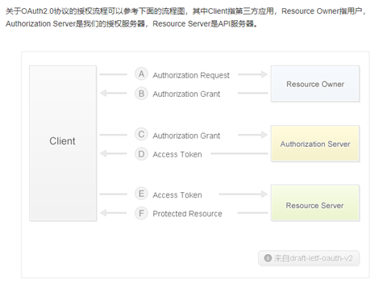
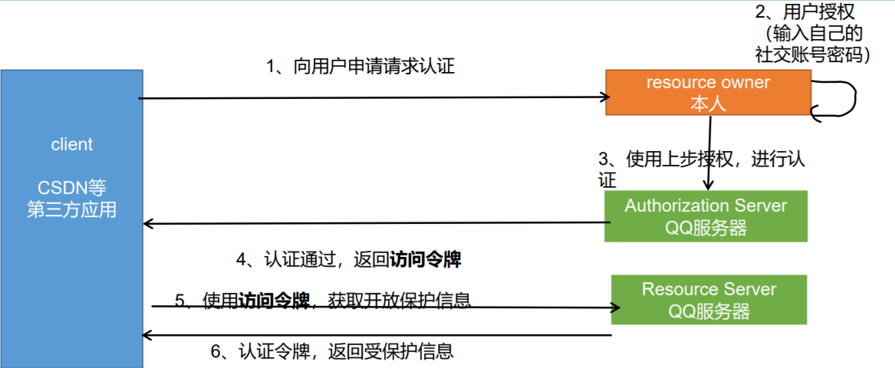
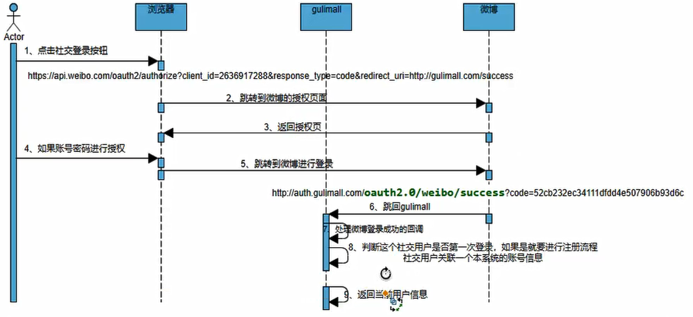
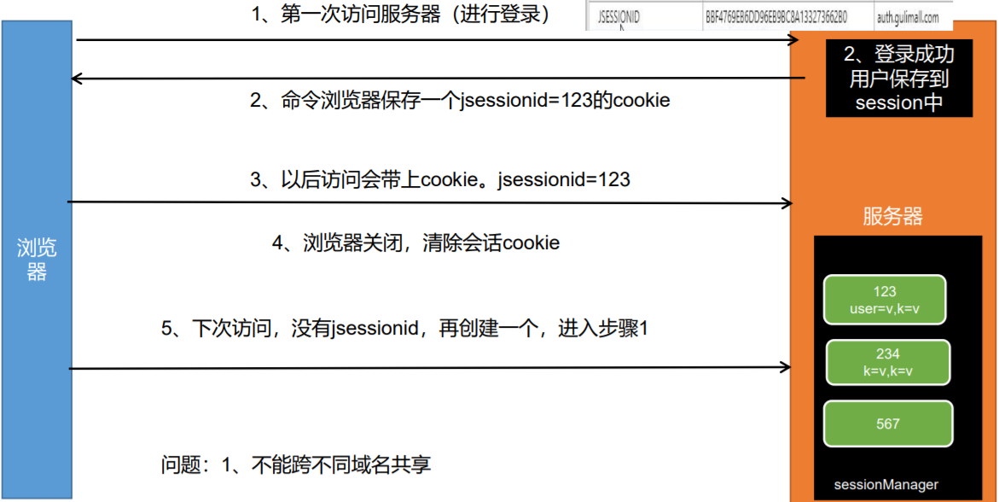
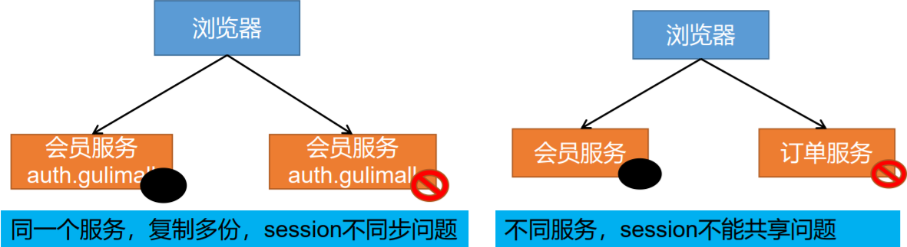
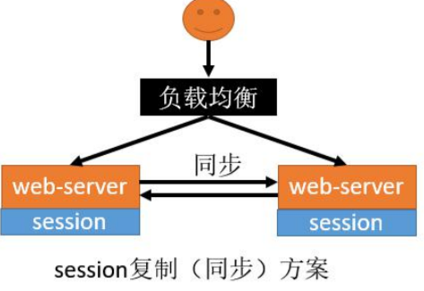
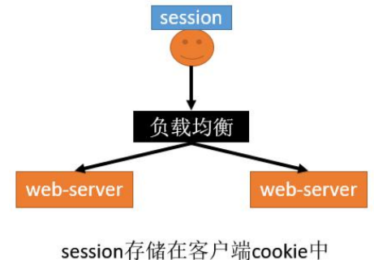
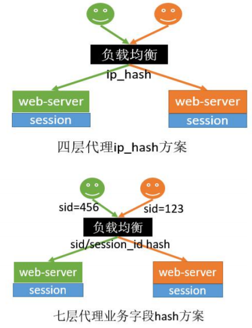
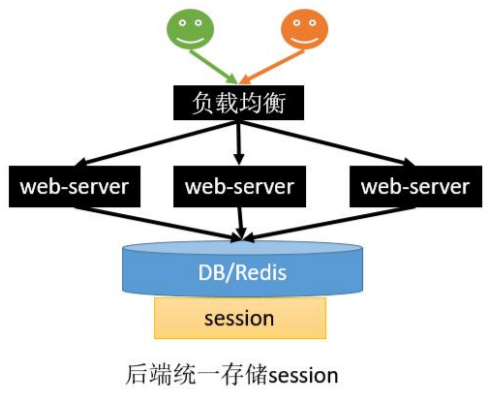

# 一、社交登陆

QQ、微博、github等网站的用户量非常大，别的网站为了简化自我网站的登陆与注册逻辑，引入社交登陆功能；

## 流程

1）、用户点击QQ按钮

2）、引导跳转到QQ授权页

3）、用户主动点击授权，跳回之前网页。

# 二、OAuth2.0

-   OAuth（开放授权）是一个开放标准，允许用户授权第三方网站访问他们存储在另外的服务提供者上的信息，而不需要将用户名和密码提供给第三方网站或分享他们数据的所有内容。

- **OAuth2.0****：**对于用户相关的OpenAPI（例如获取用户信息，动态同步，照片，日志，分享等），为了保护用户数据的安全和隐私，第三方网站访问用户数据前都需要显式的向用户征求授权。

- 官方版流程：

  

（A）用户打开客户端以后，客户端要求用户给予授权。

（B）用户同意给予客户端授权。

（C）客户端使用上一步获得的授权，向认证服务器申请令牌。

（D）认证服务器对客户端进行认证以后，确认无误，同意发放令牌。

（E）客户端使用令牌，向资源服务器申请获取资源。

（F）资源服务器确认令牌无误，同意向客户端开放资源。

1、使用Code换取AccessToken，Code只能用一次 

2、同一个用户的accessToken一段时间是不会变化的，即使多次获取

## 微博登陆准备

网址： https://open.weibo.com/

1、[接入流程](https://open.weibo.com/wiki/网站接入介绍) ： https://open.weibo.com/wiki/网站接入介绍

2、[授权机制](https://open.weibo.com/wiki/授权机制 ) : https://open.weibo.com/wiki/授权机制

# 三、分布式session

## 1、Session共享问题-session原理

## 2、Session共享问题-分布式下session共享问题

## 3、Session共享问题解决-session复制

- 优点 
  -  web-server（Tomcat）原生支持，只需要修改配置 文件 
-  缺点 
  -  session同步需要数据传输，占用大量网络带宽，降 低了服务器群的业务处理能力 
  -  任意一台web-server保存的数据都是所有web- server的session总和，受到内存限制无法水平扩展 更多的web-server 
  - 大型分布式集群情况下，由于所有web-server都全 量保存数据，所以此方案不可取。

## 4、Session共享问题解决-客户端存储

- 优点 
  -  服务器不需存储session，用户保存自己的 session信息到cookie中。节省服务端资源 
-  缺点 
  - 都是缺点，这只是一种思路。
-   具体如下： 
  -  每次http请求，携带用户在cookie中的完整信息， 浪费网络带宽 
  - session数据放在cookie中，cookie有长度限制 4K，不能保存大量信息 
  - session数据放在cookie中，存在泄漏、篡改、 窃取等安全隐患 
  - 这种方式不会使用。

## 5、Session共享问题解决-hash一致性‘

- 优点： 
  -  只需要改nginx配置，不需要修改应用代码 

  - 负载均衡，只要hash属性的值分布是均匀的，多台 web-server的负载是均衡的 \

  -  可以支持web-server水平扩展（session同步法是不行 的，受内存限制） 

- 缺点 
  - session还是存在web-server中的，所以web-server重 启可能导致部分session丢失，影响业务，如部分用户 需要重新登录 
  - 如果web-server水平扩展，rehash后session重新分布， 也会有一部分用户路由不到正确的session 
  - 但是以上缺点问题也不是很大，因为session本来都是有有 效期的。所以这两种反向代理的方式可以使用

## 5、Session共享问题解决-统一存储

- 优点： 
  - 没有安全隐患 • 可以水平扩展，数据库/缓存水平切分即 可
  - web-server重启或者扩容都不会有 session丢失

- 不足 

  -  增加了一次网络调用，并且需要修改应 用代码；如将所有的getSession方法替 换为从Redis查数据的方式。redis获取数 据比内存慢很多 
  -  上面缺点可以用SpringSession完美解决

## 6、Session共享问题解决-不同服务，子域session共享

  jsessionid这个cookie默认是当前系统域名的。当我们分拆服务，不同域名部署的时候，我们可以使用

## 7、spring - Session 原理

1）、EnableRedisHttpSession  导入 RedisHttpSessionConfiguration 

​	1、RedisIndexedSessionRepository  redis 操作  session

​	2、SessionRepositoryFilter  ===》 filter 

2）、SpringHttpSessionConfiguration 核心 

装饰者模式， 包装原生request 

自动延期，

