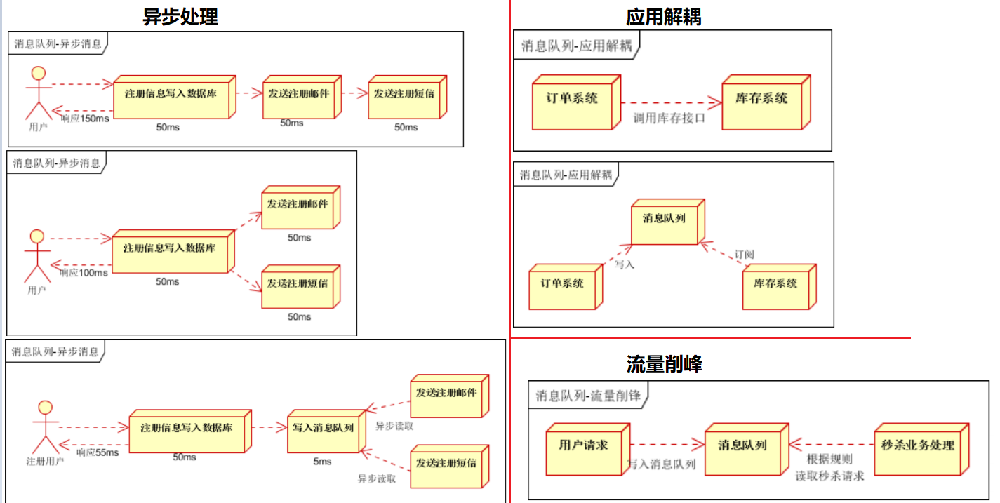
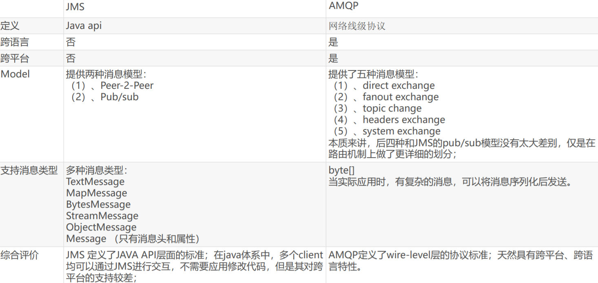
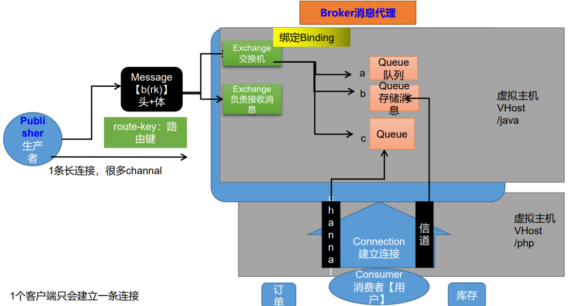
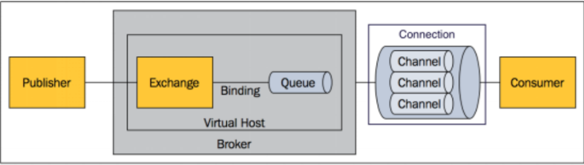
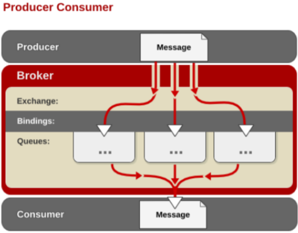
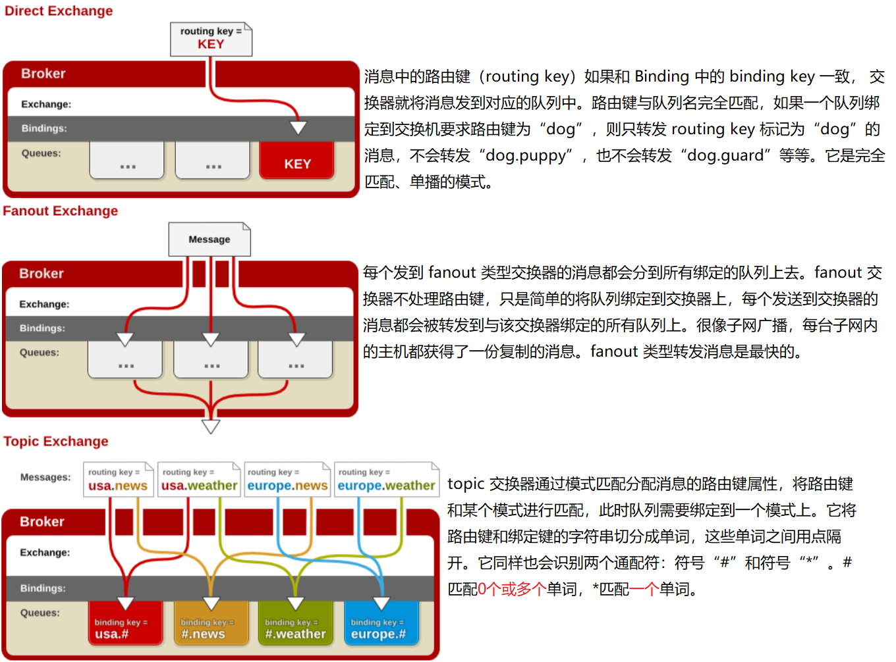
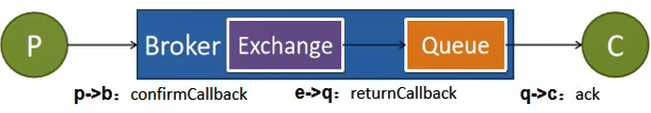

# 一、概述



1. 大多应用中，可通过消息服务中间件来提升系统异步通信、扩展解耦能力 

2.  消息服务中两个重要概念： **消息代理（message broker）**和**目的地（destination）** 

   ​	当消息发送者发送消息以后，将由消息代理接管，消息代理保证消息传递到指定目 的地。

 3. 消息队列主要有两种形式的目的地

    **队列（queue）**：点对点消息通信（point-to-point） 

    **主题（topic）**：发布（publish）/订阅（subscribe）消息通信

4. 点对点式： 

   – 消息发送者发送消息，消息代理将其放入一个队列中，消息接收者从队列中获取消息内容， 消息读取后被移出队列 – 消息只有唯一的发送者和接受者，但并不是说只能有一个接收者 

5. 发布订阅式： 

   – 发送者（发布者）发送消息到主题，多个接收者（订阅者）监听（订阅）这个主题，那么 就会在消息到达时同时收到消息

6.  JMS（Java Message Service）JAVA消息服务： 

   – 基于JVM消息代理的规范。ActiveMQ、HornetMQ是JMS实现 

7.  AMQP（Advanced Message Queuing Protocol） – 高级消息队列协议，也是一个消息代理的规范，兼容JMS – RabbitMQ是AMQP的实现



8. Spring支持 

   – spring-jms提供了对JMS的支持 

   – spring-rabbit提供了对AMQP的支持 

   – 需要ConnectionFactory的实现来连接消息代理

    – 提供**JmsTemplate**、**RabbitTemplate**来发送消息

    – @**JmsListener**（JMS）、@**RabbitListener**（AMQP）注解在方法上监听消息代理发 布的消息 

   – @**EnableJms**、@**EnableRabbit**开启支持 

9. Spring Boot自动配置 

    – JmsAutoConfiguration 

   – RabbitAutoConfiguration

# 二、RabbitMQ简介

RabbitMQ简介： RabbitMQ是一个由erlang开发的AMQP(Advanved Message Queue Protocol)的开源实现。 

## 核心概念

 ### ==Message==

消息，消息是不具名的，它由**消息头**和**消息体**组成。**消息体**是**不透明**的，而消息头则由一系列的可选属性组 成，这些属性包括routing-key（路由键）、priority（相对于其他消息的优先权）、delivery-mode（指出 该消息可能需要持久性存储）等。 

### ==Publisher==

 消息的生产者，也是一个向交换器发布消息的客户端应用程序。 

### ==Exchange==

 交换器，用来接收生产者发送的消息并将这些消息路由给服务器中的**队列**。 

Exchange有4种类型：direct(默认)，fanout, topic, 和headers，不同类型的Exchange转发消息的策略有 所区别

### ==Queue==

 消息队列，用来保存消息直到发送给消费者。它是消息的容器，也是消息的终点。一个消息 可投入**一个或多个**队列。消息一直在队列里面，等待消费者连接到这个队列将其取走。 

### ==Binding== 

绑定，用于消息队列和交换器之间的关联。一个绑定就是基于路由键将交换器和消息队列连 接起来的路由规则，所以可以将交换器理解成一个由绑定构成的路由表。 Exchange 和Queue的绑定可以是多对多的关系。 

### ==Connection==

 网络连接，比如一个TCP连接。 

### ==Channel==

 信道，多路复用连接中的一条独立的双向数据流通道。信道是建立在真实的TCP连接内的虚 拟连接，AMQP 命令都是通过信道发出去的，不管是发布消息、订阅队列还是接收消息，这 些动作都是通过信道完成。因为对于操作系统来说建立和销毁 TCP 都是非常昂贵的开销，所 以引入了信道的概念，以复用一条 TCP 连接。

### ==Consumer==

 消息的消费者，表示一个从消息队列中取得消息的客户端应用程序。

###  ==Virtual Host==

 虚拟主机，表示一批交换器、消息队列和相关对象。虚拟主机是共享相同的身份认证和加 密环境的独立服务器域。每个 vhost 本质上就是一个 mini 版的 RabbitMQ 服务器，拥有 自己的队列、交换器、绑定和权限机制。vhost 是 AMQP 概念的基础，必须在连接时指定， RabbitMQ 默认的 vhost 是 / 。

 ### ==Broker==

表示消息队列服务器实体





# 三、RabbitMQ运行机制

## 1、AMQP 中的消息路由 

AMQP 中消息的路由过程和 Java 开发者熟悉的 JMS 存在一些差别，AMQP 中增加了 Exchange 和 Binding 的角色。生产者把消息发布到 Exchange 上，消息最终到达队列并被 消费者接收，而 Binding 决定交换器的消息应该发送到那个队列。



## 2、Exchange 类型

  Exchange分发消息时根据类型的不同分发策略有区别，目前共四种类型： ==direct==、==fanout==、==topic==、headers 。headers 匹配 AMQP 消息的 header 而不是路由键， headers 交换器和 direct 交换器完全一致，但性能差很多， 目前几乎用不到了，所以直接看另外三种类型：





```sh
netstat -ano|findstr 9000
tasklist|findstr 1922
```


# 四、RabbitMQ消息确认机制-可靠抵达


- 保证消息不丢失、可靠抵达， 可以使用事务消息 ， 性能下降250倍
- **publisher** confirmCallback 确认模式
- **publisher** returnCallback 未投递到queue退回模式
- **consumer** ack机制



## 1、可靠抵达-ConfirmCallback

```properties
spring.rabbitmq.publisher-confirms=true
```

- 在创建connectionFactory的时候publishConfirms(true) 选项 开启confirmCallback 
- CorrelationData ： 用来表示当前消息唯一性
- 消息只要被broker接收就会执行confirmCallback ，如果是cluster模式，需要所有broker接收带才会调用confirmCallback
- 被broker接收到只能表示message已经到达服务器 ，并不能保证消息一定会被投递到目标queue里 ， 所以需要用到接下来的returnCallback

## 2、可靠抵达-ReturnCallback

```properties
spring.rabbitmq.publisher-returns=true
spring.rabbitmq.template. mandatory= true
```

-Confirm 模式只能保证消息到达broker，不能保证消息准确投递到目标queue里。在有些业务场景下，我们需要保证一定都到目标queue里，此刻就需要用到return退回模式

-这样如果未能投递到目标queue里 将盗用returnCallback， 可以记录下详细到投递数据，定期巡检或者地洞纠错需要这些数据

## 3、可靠抵达-Ack消息确认机制

```properties
spring.rabbitmq.listener.direct.acknowledge-mode=manual
```

- 消费者获得消息，成功处理，可以回复Ack给Broker

  -basic.ack 用于肯定确认 ； broker将移除此详细

  -basic.nack用于否定确认 ；可以指定broker是否丢弃此消息，可以批量

  -basic.reject用于否定确认 ； 同时，但不能批量

- 默认。消息被消费者收到，就会从broker的queue中移除

- queue无消费者，消息依然会被存储，直到消费者消费

- 消费者收到消息，默认会自动ack，但是如果无法确定此消息是否被处理完成，或者处理成功。可以开启手动ack模式

  -消息处理成功 ack() 界都下一个消息，此消息broker就会被移除

  -消息处理失败，nack()/reject()，从新发送给其他人进行处理，或者容错处理后ack

  -消息一致没有调用ack/nack，broker认为此消息正在被处理，不会投递给被人，此时客户端断开，消息不会被broker异常，会投递给别人

# 五、RabbitMQ 延时队列（实现定时任务）


### 场景：

比如为付款订单，超过一定时间后，系统自动取消订单，并释放占有物品

### **常用解决方案**

spring的schedule定时任务轮询数据库

#### **缺点：**

​	消耗系统内存、增加数据库的压力、存在较大的时间误差

#### **解决：**

rabbitmqde 消息TTL 和死信Exchange结合


