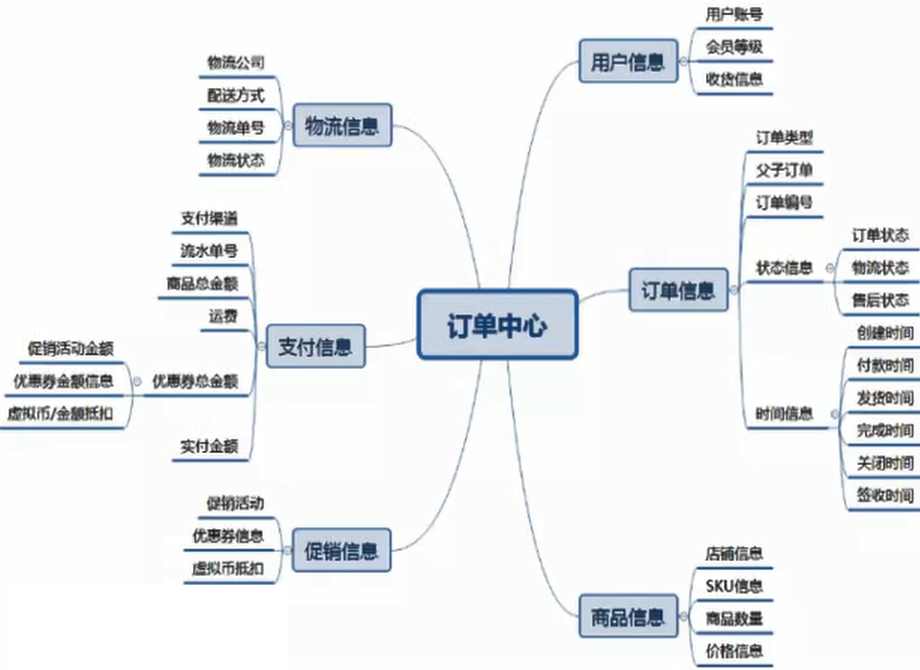
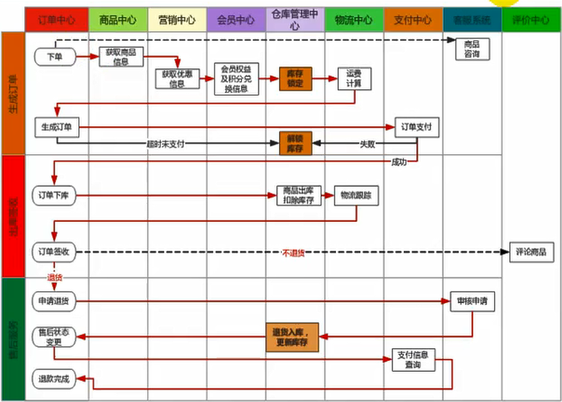

## 一、订单的构成

## 二、订单状态

### 1、待付款

用户提交订单后，订单进行预下单，目前主流电商网站都会唤起支付，便于用户快速完成支付，待付款状态下可以对库进行锁定，锁定库存需要配置支付超时时间，超时后将自动取消订单，订单 变 关闭状态

### 2、已付款/待发货

用户完成订单支付，订单系统需要记录支付时间，支付流水单号便于队长，订单下方到wms系统，厂库进行调拨，配货、分拣、出库等

### 3、待收货、已发货

###  4、已完成

### 5 、已取消

### 6、售后中

## 三、订单流程

==订单生成->支付订单->卖家发货->  确认收货 -> 购物成功==

#### 1、订单的创建于支付

1、预览订单、选择收货信息

2、锁定库存、有库存才可以创建

3、创建后支付超时需要解库存

4、支付成功后，需要进行拆单，根据商品打包方式，所在仓库，物流进行拆单

5、支付每一笔流水都要记录，以待查账

6、创建订单，支付成功等状态都要给MQ大消息，一遍其他系统感知订阅

#### 2、逆向流程

1、修改订单

2、订单取消

## 四、幂等性处理

## 五、订单业务

