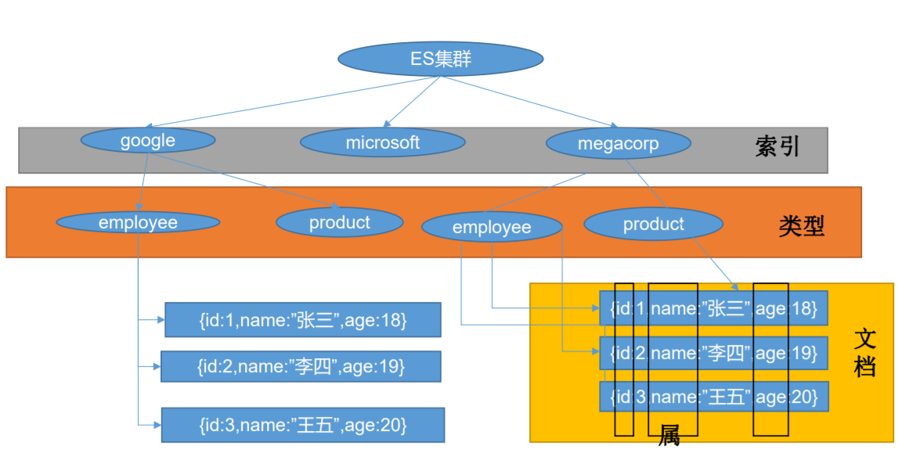

# 一、ElasticSearch初步


## 1、_cat

| 查看内容可选值 | 说明               |
| -------------- | ------------------ |
| indices        | 查看es中有哪些索引 |
| health         | 查看es健康状况     |
| master         | 查看主节点         |
| nodes          | 查看所有节点       |

> 参数 v   : 显示表头  例：GET /_cat/indices?v
>
>  es 中会默认存在一个名为.kibana的索引

#### 

| 表头           | 含义                                                         |      |
| -------------- | ------------------------------------------------------------ | ---- |
| health         | green (集群完整)  yellow  (单点正常、集群不完整)   red (单点不正常) |      |
| status         | 是否能使用                                                   |      |
| index          | 索引名                                                       |      |
| uuid           | 索引统一编号                                                 |      |
| pri            | 主节点几个                                                   |      |
| rep            | 从节点几个                                                   |      |
| docs.count     | 文档数                                                       |      |
| docs.deleted   | 文档被删了多少                                               |      |
| store.size     | 整体占空间大小                                               |      |
| pri.store.size | 主节点占                                                     |      |


## 2、索引(库)

```http
PUT /movie_index (索引名)   # 添加一个索引
DELETE  /movie_index    # 删除一个索引
```

## 3、文档(类似于MySQL的表)

```sh
# 1、新增文档
	PUT /index/type/id (索引/文档/id  ==> 数据库/表/id) 
# 例
    PUT /costomer/external/1
    {"name":"John Doe"}
# 响应结果   以 _ 开头的都是元数据
{
  "_index" : "costomer",    # 所用的索引  数据库
  "_type" : "external",    #  类型       表
  "_id" : "1",             # id
  "_version" : 1,			# 版本  不断增长
  "result" : "created",    
  "_shards" : {           # 分片
    "total" : 2,
    "successful" : 1,
    "failed" : 0
  },
  "_seq_no" : 0,         # 序列号 ， 并发控制字段 ， 每次更新就会 +1 用来做乐观锁
  "_primary_term" : 1    # 同上、主分片重新分配 ， 如重启 ，就会变化
}
```

> 更新时携带 ?if_seq_no=0&if_primary_term=1   比较修改 ，  如果都是对应的就修改，否者放弃      新版用序列号（seq_no ） 老版用版本号
>
> PUT 和 POST 都可以 ；  POST 可以不指定id， 会自动生成 ， PUT 必须指定 （一个全覆盖的作用, 数据整体修改）

```sh
# 2、查询文档
	GET /costomer/external/1  

# 更新文档
# 1、整体修改  ： 之前用到的 put、post
# 2、局部修改
POST movie_index/movie/3/_update
{  "doc":{
    "name":"updata name"
 }}
# post 会自动的 比对 ， 如果更新值相同 则不会叠加版本号 

# 3、删除文档
	DELETE costomer/external/1  

# 4、批量导入 bulk  ， 两行为一个整体
	POST costomer/external/_bulk
    {"index":{"_id": "1"}}
    {"name":"John Doe"}
    {"index":{"_id": "2"}}
    {"name":"John Doe"}
# 批量导入  语法格式
{action: { metadata }}
{request body}

# **复杂实例**
POST /_bulk
{"delete":{"_index":"website","_type":"blog","_id":"123"}}
{"create":{"_index":"website","_type":"blog","_id":"123"}}
{"title":"my first website"}
```

### 批量导入测试数据：

测试数据： https://github.com/elastic/elasticsearch/blob/master/docs/src/test/resources/accounts.json

文档地址：https://www.elastic.co/guide/en/elasticsearch/reference/current/getting-started-search.html

# 二、ElasticSearch检索 

## 1、SearchApi

ES 支持两种基本方式的检索

- 一个是通过使用REST request URL 发送参数 

- 通过REST request body 来发送检索（URL + 请求体）

### 1）、检索信息 _search

  官网文档地址：https://www.elastic.co/guide/en/elasticsearch/reference/current/getting-started-search.html

| 请求方式 | 举例                                                         |
| -------- | ------------------------------------------------------------ |
| URL传参  | GET bank/_search?q=*&sort=account_number:asc                 |
| body     | GET bank/_search<br/>{<br/>  "query": {<br/>    "match_all": {}<br/>  },<br/>  "sort": [<br/>    {<br/>      "account_number": "asc"<br/>    }<br/>  ]<br/>} |


```sh
took – how long it took Elasticsearch to run the query, in milliseconds  检索花费的时间（毫秒）
timed_out – whether or not the search request timed out  检索是否超时
_shards – how many shards were searched and a breakdown of how many shards succeeded, failed, or were skipped.多少个分片被搜索了，以及成功、失败的搜索分片
max_score – the score of the most relevant document found   最高得分（全文检索用）
hits.total.value - how many matching documents were found 搜索结果
hits.sort - the document’s sort position (when not sorting by relevance score)  排序结果key（键） 
hits._score - the document’s relevance score (not applicable when using match_all) 相关性得分
  
```

##  2、QueryDSL

DSL(domain-specific-language 领域特定语言) 

### 1、检索

| key          | 位置      | 作用                                                         |
| ------------ | :-------- | ------------------------------------------------------------ |
| query        | 根        | 查询                                                         |
| sort         | 根        | 排序                                                         |
| from         | 根        | 从多少条记录开始                                             |
| size         | 根        | 要多少条数据                                                 |
| _source      | 根        | [ “字段名”]  指定需要返回的结果集                            |
| math         | query下   | 非字符串-精确匹配 ， 字符串-模糊匹配 ，按评分排序，会对检索条件进行分词 |
| match_phrase | query下   | 短语匹配 ， 不会进行分词                                     |
| multi_math   | query下   | 多字段匹配， 满足一个就可以 ， 会分词                        |
| bool         | query下   | 复合查询    must： 必须   must_not: 不等于   should : 劲量满足 ， 不满足也可以 |
| rang         | query下   | 区间                                                         |
| filter       | query下   | 过滤  不贡献积分                                             |
| term         | qurery 下 | 精确的 用 term                                               |

### 2、aggregations（执行聚合）

```sh
GET bank/_search
{
  "query": {
    "match": {
      "address": "mill"
    }
  },
  "aggs": {
    "ageAgg": {
      "terms": {
        "field": "age",
        "size": 10
      }
    },
    "ageAvg":{
      "avg": {
        "field": "age"
      }
    },
    "blanceAvg":{
      "avg": {
        "field": "balance"
      }
    }
  },
  "size": 0
}

GET bank/_search
{
  "query": {
    "match_all": {}
  }
  , "aggs": {
    "ageAgg": {
      "terms": {
        "field": "age",
        "size": 100
      }
      , "aggs": {
        "ageAvg": {
          "avg": {
            "field": "balance"
          }
        }
      }
    }
  }
  , "size": 0
}
GET bank/_search
{
  "query": {
    "match_all": {}
  },
  "aggs": {
    "ageAgg": {
      "terms": {
        "field": "age",
        "size": 100
      },
      "aggs": {
        "genderAgg": {
          "terms": {
            "field": "gender.keyword",
            "size": 10
          }
          , "aggs": {
            "blanceAvg": {
              "avg": {
                "field": "balance"
              }
            }
          }
        },
        "blanceAvg":{
          "avg": {
                "field": "balance"
              }
        }
      }
    }
  },
  "size": 0
}
```

## 3、mapping

```sh
PUT /bank
{
  "mappings": {
    "properties": {
      "account_number": {
        "type": "long"
      },
      "address": {
        "type": "text"
      },
      "age": {
        "type": "integer"
      },
      "balance": {
        "type": "long"
      },
      "city": {
        "type": "keyword"
      },
      "email": {
        "type": "keyword"
      },
      "employer": {
        "type": "keyword"
      },
      "firstname": {
        "type": "text"
      },
      "gender": {
        "type": "keyword"
      },
      "lastname": {
        "type": "text",
        "fields": {
          "keyword": {
            "type": "keyword",
            "ignore_above": 256
          }
        }
      },
      "state": {
        "type": "keyword"      }
    }
  }
}
```


## 4、数据迁移

```sh
POST _reindex
{
  "source": {
    "index": "blank" ,
    "type": "account"
  },
  "dest": {
    "index": "bank"
  }
}
```

### ElasticSearch7-去掉 type概念

 • 关系型数据库中两个数据表示是独立的，即使他们里面有相同名称的列也不影响使用，但ES 中不是这样的。elasticsearch是基于Lucene开发的搜索引擎，而ES中不同type下名称相同 的filed最终在Lucene中的处理方式是一样的。

​	 • 两个不同type下的两个user_name，在ES同一个索引下其实被认为是同一个filed，你必 须在两个不同的type中定义相同的filed映射。否则，不同type中的相同字段名称就会在 处理中出现冲突的情况，导致Lucene处理效率下降。 

​	• 去掉type就是为了提高ES处理数据的效率。 

• Elasticsearch 7.x • URL中的type参数为可选。比如，索引一个文档不再要求提供文档类型。 • Elasticsearch 8.x • 不再支持URL中的type参数。

 • 解决：将索引从多类型迁移到单类型，每种类型文档一个独立索引

##  5、分词

```sh
POST _analyze
{
  "analyzer": "standard",
  "text": "谷粒电商"
}
```