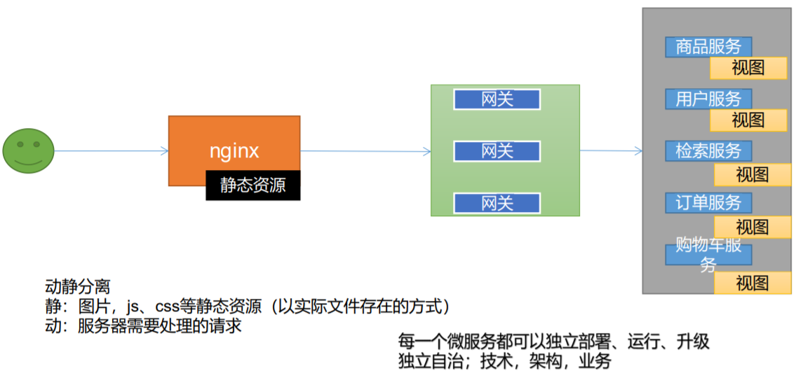

# 一 、java操作elasticsearch

官网地址：https://www.elastic.co/guide/en/elasticsearch/client/java-rest/current/java-rest-high.html

## 1、导入依赖

```java
 <elasticsearch.version>7.4.2</elasticsearch.version> 
 
 <!--elasticsearch依赖-->
 <dependency>
      <groupId>org.elasticsearch.client</groupId>
      <artifactId>elasticsearch-rest-high-level-client</artifactId>
      <version>${elasticsearch.version}</version>
 </dependency> 
```

## 2、索引模型

 ```json
PUT product
{
    "mapping":{
        "properties":{
            "skuId":{
                "type":"long"
            },
            "spuId":{
            	"type":"keyword"
        	},
            "skuTitle":{
                "type":"text",
                "analyzer":"ik_smart"
            },
            "skuPrice":{
                "type":"keyword"
            },
            "skuImg":{
                "type":"keyword",
                "index":false,
                "doc_values":false
            },
            "saleCount":{
                "type":"long"
            },
            "hasStock":{
                "type":"boolean"
            },
            "hotScore":{
                "type":"long"
            },
            "brandId":{
            	"type":"long"
            },
            "categoryId":{
                "type":"long"
            },
            "brandName":{
                "type":"keyword",
                "index":false,
                "doc_values":false
            },
            "brandImg":{
                "type":"keyword",
                "index":false,
                "doc_values":false
            },
            "categoryName":{
                "type":"keyword",
                "index":false,
                "doc_values":false
            },
            "attrs":{
                "type":"nested" ,
                "properties":{
                    "attrId":{
                        "type":"long"
                    },
                    "attrName":{
                        "type":"keyword",
                        "index":false,
                        "doc_values":false
                    },
                    "attrValue":{
                         "type":"keyword"
                    }
                }
            }
        }
    }
}
 ```

 "type":"nested"  内部值


# 二、项目微服务

