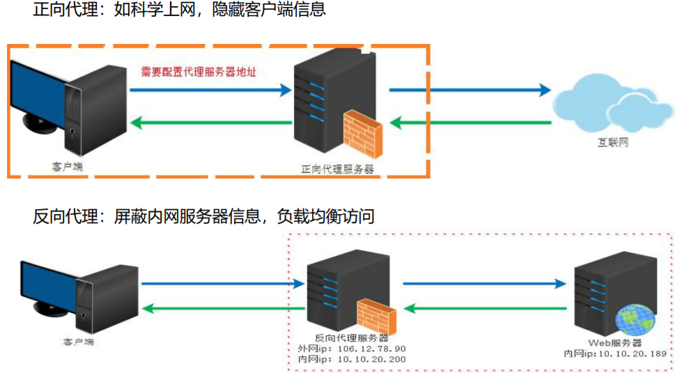
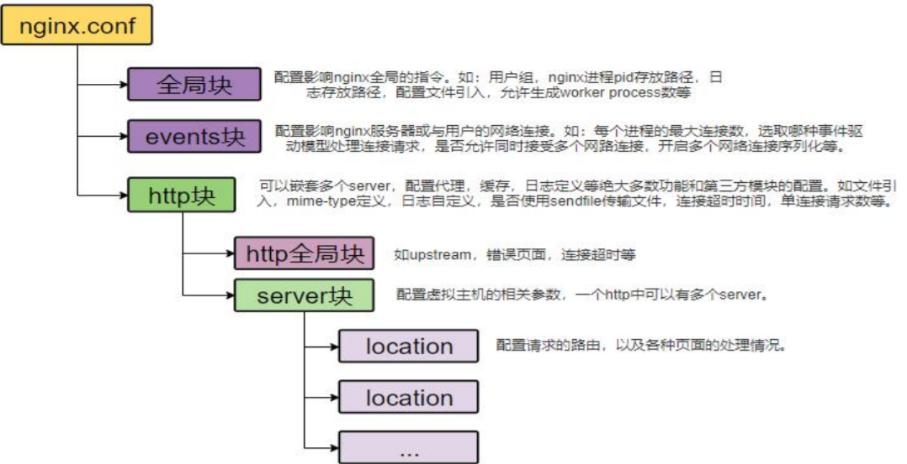

# 一 、Nginx+Windows搭建域名访问环境


## 1、正向代理&反向代理




## 2、hosts 配置

```sh
66.88.88.200 gulimall.com
66.88.88.200 search.gulimall.com
66.88.88.200 order.gulimall.com
```

## 3、Nginx配置文件



```sh
proxy_set_header Host $host
```

