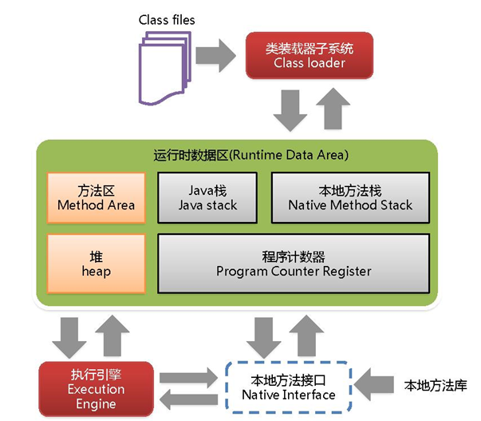
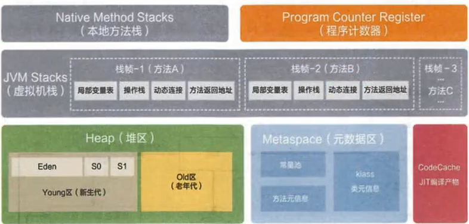

# 一 压力测试

有效压力测试系统关键条件：**重复**、**并发**、**量级**、**随机变化**

## 1、性能指标

- 响应时间（Response Time: RT）: 发起请求到响应结束

- HPS(Hits Per Second) : 每秒点击数  ， 次/秒

- TPS(Transction per Second): 处理交易数

- QPS(Query Per Second) : 每秒处理查询次数

- 最大响应时间（Max Response Time）

- 最小响应时间（）

- 90%响应时间

- 从外部看， 性能测试主要关注如下三个指标
  - 吞吐量：每秒系统能够处理的请求数、任务数
  - 响应时间：耗时
  - 错误率：请求出错比率
- 影响性能考虑点包括

  > 数据库、编码、中间件（tomcat 、Nginx） 、网络和 操作系统

- 首先考虑应用属于 **CPU密集型**还是**IO密集型**

## 2、JMeter Address  Already in-use 错误

windows 本身提供的端口访问机制的问题

Windows 提供TCP/IP链接的端口为1024-5000，并且4分钟来循环回收。 就导致短时间内端口沾满

```sh
# 1、cmd 中 regedit 打开注册表
# 2、\HKEY_LOCAL_MACHINE\SYSTEM\CurrentControlSet\Services\Tcpip\Parameters 
#   右击  Parameters -> 新建DWORD   
# 	  1 、名 MaxUserPort  值 65534
#	  2、 TCPTimedWaitDelay    30
# 3、修改完成后重启生效
```

微软官网帮助文档地址： https://support.microsoft.com/zh-cn/help/196271/when-you-try-to-connect-from-tcp-ports-greater-than-5000-you-receive-t


 #  二、性能监控

## 1、图解





>  永久代/元空间   ：  java8以前，受jvm管理， java8 后元空间，直接使用物理内存。因此默认情况下，元空间大小仅受本地内存限制
>
> Eden : from : to = 8 : 1 : 1

## 2、jsonsole与jvisualvm

插件更新地址： http://visualvm.github.io/pluginscenters.html