# 一、缓存

## 1、缓存使用

为了提高系统性能，将部分数据放入缓存中，加速访问。而db承担落盘工作

## 2、哪些数据适合放入缓存

- 及时性、数据一致性要求不高的

- 访问量大且更新频率不高的数据(读多、写少)

  

## 3、缓存处理逻辑

  

## 4、本地缓存

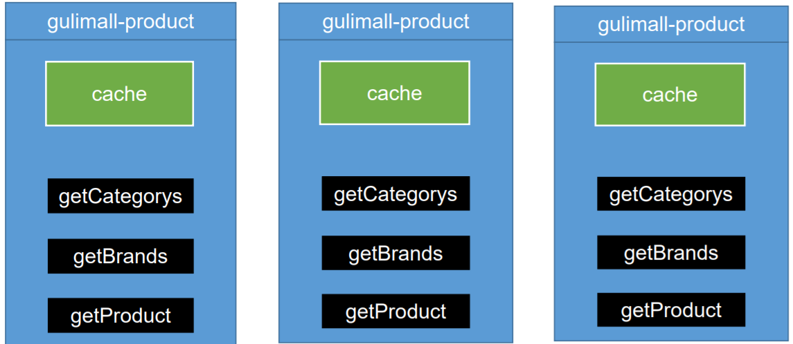

## 5、分布式缓存

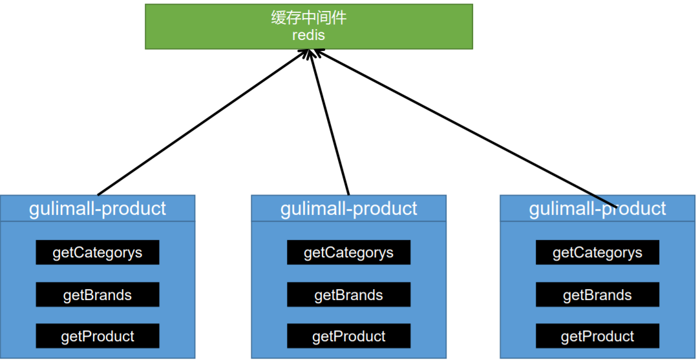

# 二、分布式缓存3大问

## 1、缓存穿透

### ①、含义

 指查询一个一定**不存在的数据**，由于缓存是不命中，将去查询数据库，但是 数据库也无此记录，我们没有将这次查询的null写入缓存，这将导致这个不 存在的数据每次请求都要到存储层去查询，失去了缓存的意义

### ②、风险

 利用不存在的数据进行攻击，数据库瞬时压力增大，最终导致崩溃

### ③、解决

 null结果缓存，并加入短暂过期时间
## 2、缓存雪崩

### ①、含义

缓存雪崩是指在我们设置缓存时key采用了相同的过期时间， 导致缓存在某一时刻同时失效，请求全部转发到DB，DB瞬时 压力过重雪崩

### ②、解决

原有的失效时间基础上增加一个随机值，比如1-5**分钟随机**，这 样每一个缓存的过期时间的重复率就会降低，就很难引发集体 失效的事件

## 3、缓存击穿

### ①、含义

- 对于一些设置了过期时间的key，如果这些key可能会在某些 时间点被超高并发地访问，是一种非常“热点”**的数据**。
- 如果这个key在大量请求同时进来前正好失效，那么所有对 这个key的数据查询都落到db，我们称为缓存击穿。

### ②、解决

 null结果缓存，并加入短暂过期时间

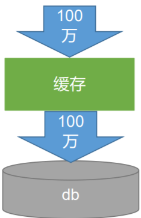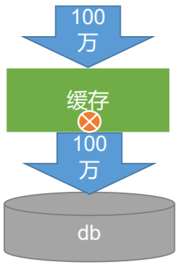


# 三、本地锁

## 1、sycnhronized 、JUC(lock)

```java
spring 中 默认是单例的 ， 一个服务 也是查询一遍
```

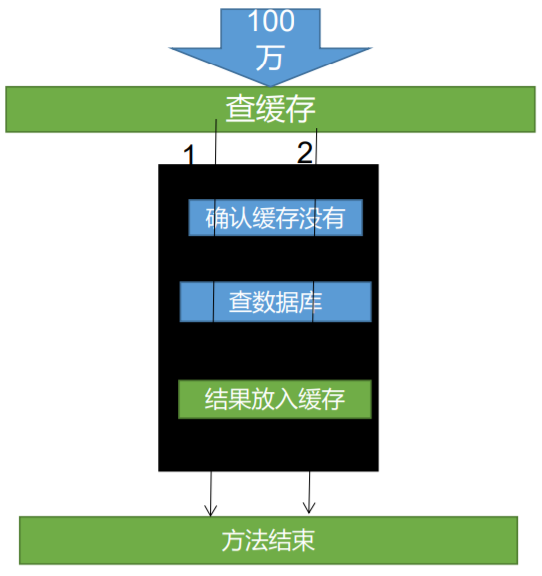

## 2、问题

1、锁不住 ，多次查询数据库？

释放锁的瞬间，因网络延迟的原因， 判断缓存的时间，大量线程进来，导致多次查询数据库。

解决： 将放入缓存与数据库查询放在一起，作为一个原子操作 。

# 四、分布式锁

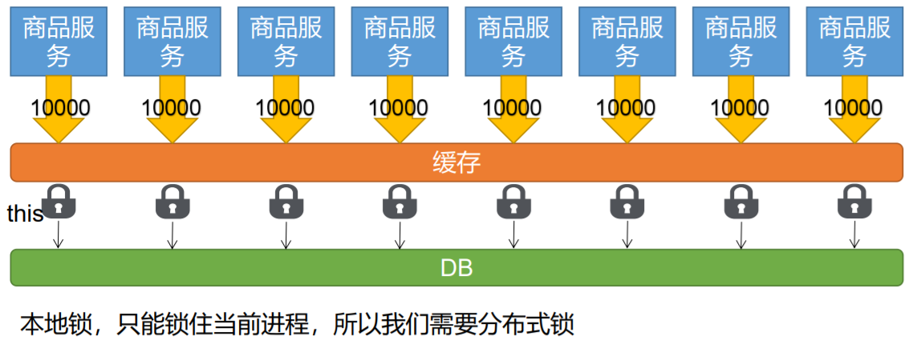


## 1、基本原理

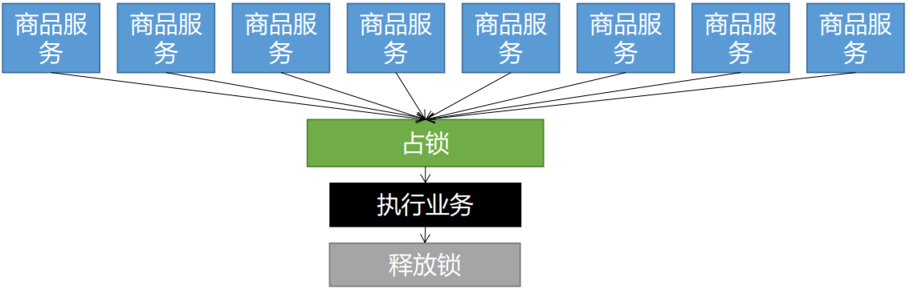

我们可以同时去一个地方“占坑”，如果占到，就执行逻辑。否则就必须等待，直到释放锁。 “占坑”可以去redis，可以去数据库，可以去任何大家都能访问的地方。 等待可以**自旋**的方式。

redis文档地址： http://redisdoc.com/

## 2、分布式锁演进-阶段一

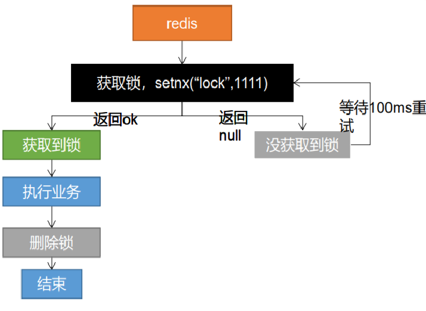

```java
// 1、占分布式锁。去redis占坑
Boolean lock = redisTemplate.opsForValue().setIfAbsent("lock","111") ;
if(lock){
    //加锁成功，执行业务 
}else{
   // 加锁失败， 休眠重试 
}
```

### 问题：

 setnx占好了位，业务代码异常或者程序在页面过程 中宕机。没有执行删除锁逻辑，这就造成了**死锁** 

###  解决： 

设置锁的自动过期，即使没有删除，会自动删除


## 3、分布式锁演进-阶段二

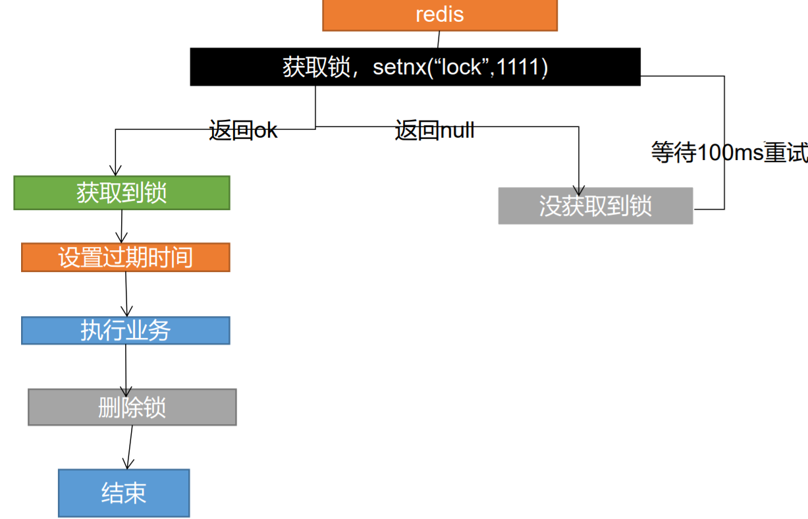

```java
redisTemplate.expire("lock",30,TimeUnit.SECONDs)
```

### 问题：

 setnx设置好，正要去设置过期时间，宕机。又**死锁**了。 

###  解决：

 设置过期时间和占位必须是原子的。redis支持使用**setnx ex** 命令


## 4、分布式锁演进-阶段三

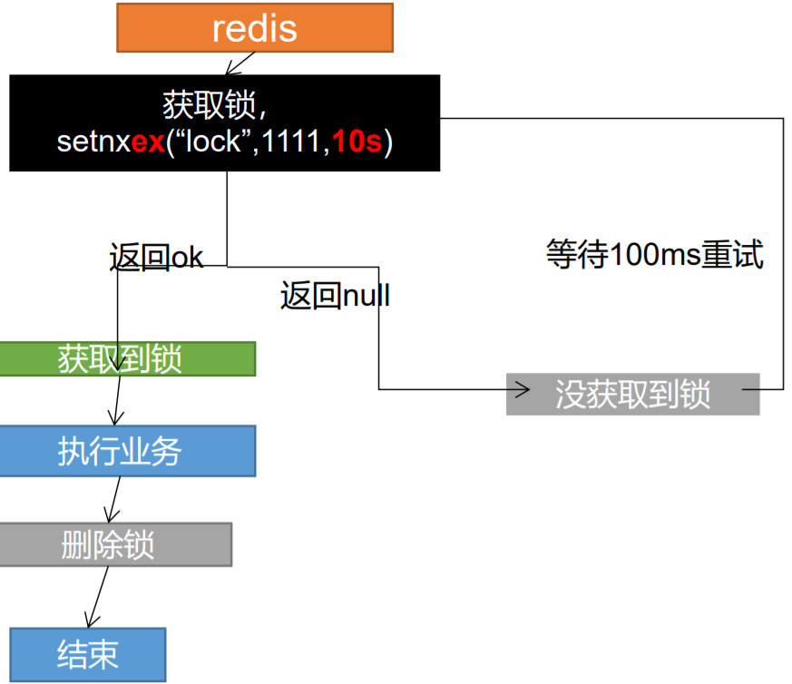

```java
redisTemplate.delete("lock") ;// 删除锁
```

### 问题： 

删除锁直接删除？？？ 如果由于业务时间很长，锁自己过期了，我们 直接删除，有可能把别人正在持有的锁删除了。

###  解决： 

占锁的时候，值指定为uuid，每个人匹配是自己 的锁才删除。

## 5、分布式锁演进-阶段四

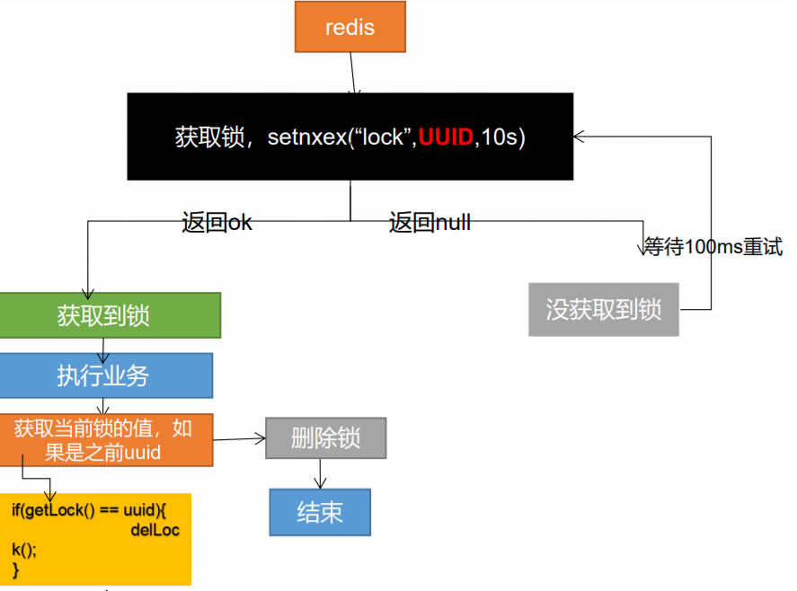

### 问题： 

如果正好判断是当前值，正要删除锁的时候，锁已经过期， 别人已经设置到了新的值。那么我们删除的是别人的锁

##  解决： 

删除锁必须保证原子性。使用**redis+Lua**脚本完成

## 6、分布式锁演进-阶段五-最终形态

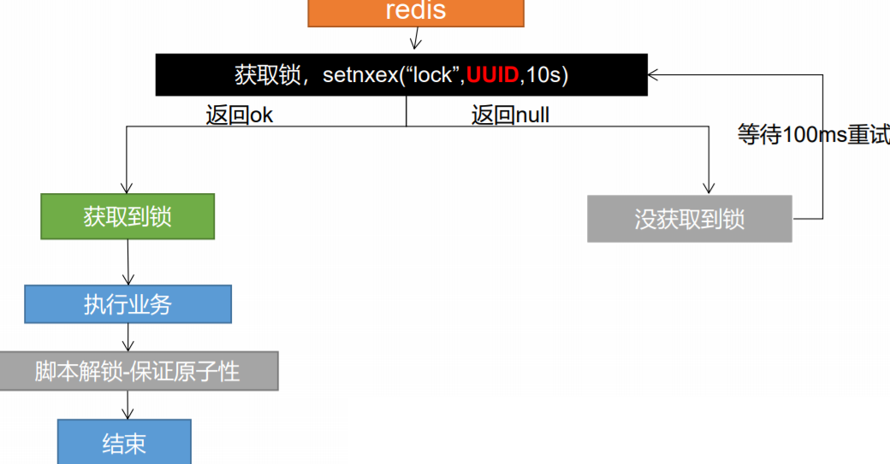

```java
String script = "if redis.call('get', KEYS[1]) == ARGV[1] then return redis.call('del', KEYS[1]) else return 0 end";
//保证加锁【占位+过期时间】和删除锁【判断+删除】的原子性。
```

>  更难的事情，锁的**自动续期**

## 分布式锁实现-redisson

GitHub地址： https://github.com/redisson/redisson/wiki

:lock:锁的名字。锁的粒度，越细越快  ， product:11:lock

# 五、缓存数据一致性

## 1、双写模式

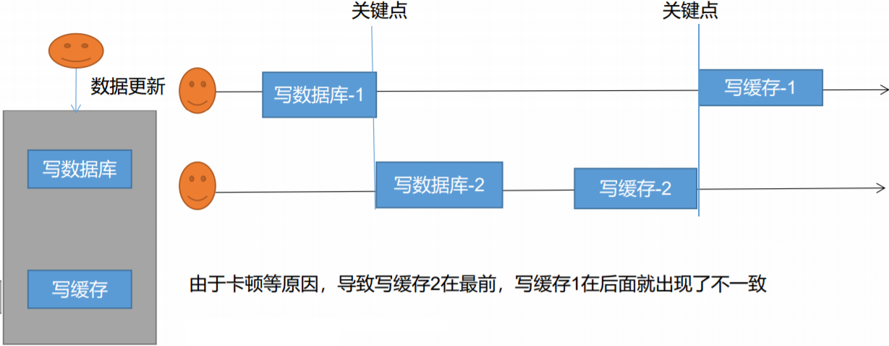

### 脏数据问题：

这是暂时性的脏数据问题，但是在数据稳定，缓存过期以后，又能得到最新的正确数据

### 读到的最新数据有延迟：==最终一致性==

## 2、失效模式

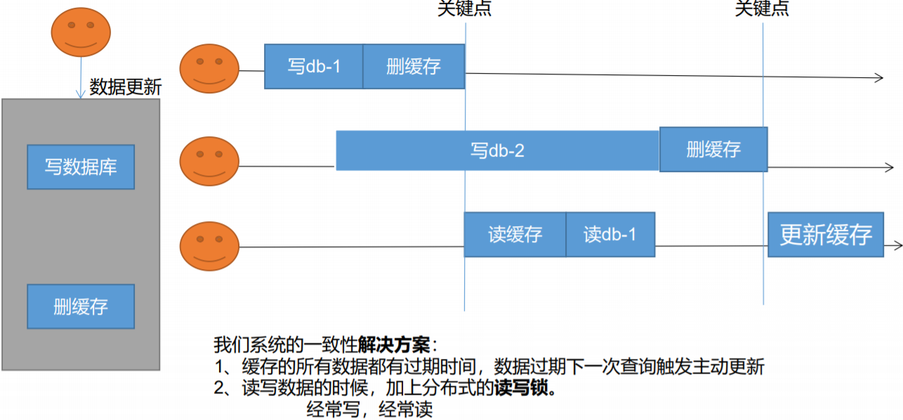

## 3、解决方案

##### 无论是双写模式还是失效模式，都会导致缓存的不一致问题。即多个实例同时更新会出事。怎么办？ 

1. 如果是用户纬度数据（订单数据、用户数据），这种并发几率非常小，不用考虑这个问题，缓存数据加 上过期时间，每隔一段时间触发读的主动更新即可

2. 如果是菜单，商品介绍等基础数据，也可以去使用==canal==订阅binlog的方式。 

3. 缓存数据+过期时间也足够解决大部分业务对于缓存的要求。 

4. 通过加锁保证并发读写，写写的时候按顺序排好队。读读无所谓。所以适合使用读写锁。（业务不关心 脏数据，允许临时脏数据可忽略）；

##### 总结： 

   1. 我们能放入缓存的数据本就不应该是实时性、一致性要求超高的。所以缓存数据的时候加上过期时间，保 证每天拿到当前最新数据即可。

   2. 我们不应该过度设计，增加系统的复杂性

   3. 遇到实时性、一致性要求高的数据，就应该查数据库，即使慢点。

## 4、解决-Canal

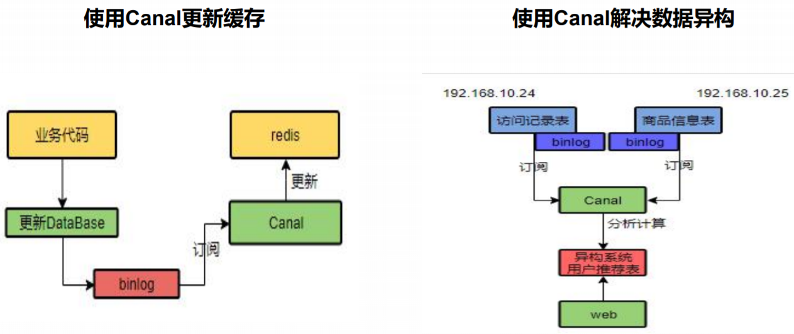

